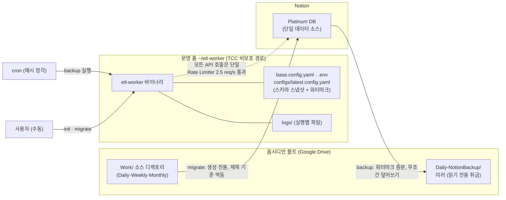
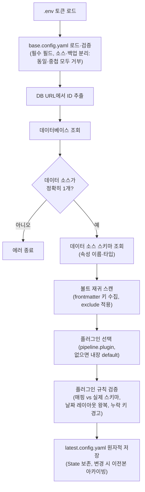
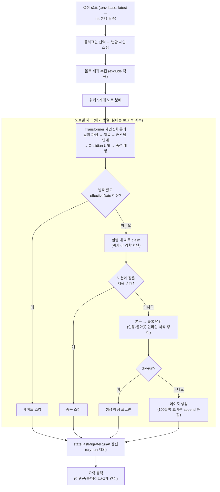
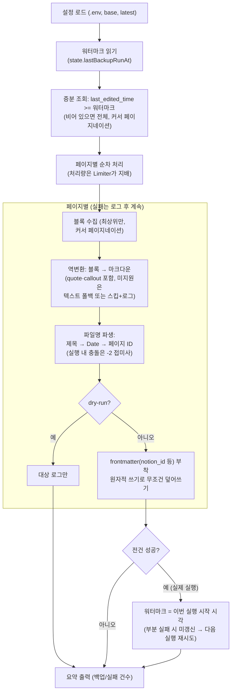

# Diagrams

작성일: 2026-09-03

## Architure

```mermaid
flowchart LR
    subgraph vault["옵시디언 볼트 (Google Drive)"]
        work["Work/ 소스 디렉토리<br/>(Daily·Weekly·Monthly)"]
        mirror["Daily-NotionBackup/<br/>미러 (읽기 전용 취급)"]
    end

    subgraph ops["운영 홈 ~/etl-worker (TCC 비보호 경로)"]
        bin["etl-worker 바이너리"]
        cfg["base.config.yaml · .env<br/>configs/latest.config.yaml<br/>(스키마 스냅샷 + 워터마크)"]
        logs["logs/ (실행별 파일)"]
        bin --- cfg
        bin --- logs
    end

    subgraph notion["Notion"]
        db["Platinum DB<br/>(단일 데이터 소스)"]
    end

    cron["cron (매시 정각)"] -->|"backup 실행"| bin
    user["사용자 (수동)"] -->|"init · migrate"| bin

    work -->|"migrate: 생성 전용, 제목 기준 멱등"| db
    db -->|"backup: 워터마크 증분, 무조건 덮어쓰기"| mirror

    bin -.->|"모든 API 호출은 단일<br/>Rate Limiter 2.5 req/s 통과"| db
```

 

## Flow Charts

### init

```mermaid
flowchart TD
    A[".env 토큰 로드"] --> B["base.config.yaml 로드·검증<br/>(필수 필드, 소스·백업 분리:<br/>동일·중첩 모두 거부)"]
    B --> C["DB URL에서 ID 추출"]
    C --> D["데이터베이스 조회"]
    D --> E{"데이터 소스가<br/>정확히 1개?"}
    E -- "아니오" --> X1["에러 종료"]
    E -- "예" --> F["데이터 소스 스키마 조회<br/>(속성 이름·타입)"]
    F --> G["볼트 재귀 스캔<br/>(frontmatter 키 수집, exclude 적용)"]
    G --> H["플러그인 선택 (pipeline.plugin,<br/>없으면 내장 default)"]
    H --> I["플러그인 규칙 검증<br/>(매핑 vs 실제 스키마,<br/>날짜 레이아웃 왕복, 누락 키 경고)"]
    I --> J["latest.config.yaml 원자적 저장<br/>(State 보존, 변경 시 이전본 아카이빙)"]
```

### migrate

```mermaid
flowchart TD
    A["설정 로드 (.env, base, latest —<br/>init 선행 필수)"] --> B["플러그인 선택 → 변환 체인 조립"]
    B --> C["볼트 재귀 수집 (exclude 적용)"]
    C --> D["워커 5개에 노트 분배"]

    subgraph worker["노트별 처리 (워커 병렬, 실패는 로그 후 계속)"]
        E["Transformer 체인 1회 통과<br/>날짜 파생 → 제목 → 커스텀 단계<br/>→ Obsidian URI → 속성 매핑"] --> F{"날짜 있고<br/>effectiveDate 이전?"}
        F -- "예" --> S1["게이트 스킵"]
        F -- "아니오" --> G["실행 내 제목 claim<br/>(워커 간 경합 차단)"]
        G --> H{"노션에 같은<br/>제목 존재?"}
        H -- "예" --> S2["중복 스킵"]
        H -- "아니오" --> I["본문 → 블록 변환<br/>(인용·콜아웃·인라인 서식·청킹)"]
        I --> J{"dry-run?"}
        J -- "예" --> S3["생성 예정 로그만"]
        J -- "아니오" --> K["페이지 생성<br/>(100블록 초과분 append 분할)"]
    end

    D --> E
    K --> L["state.lastMigrateRunAt 갱신<br/>(dry-run 제외)"]
    S1 & S2 & S3 --> L
    L --> M["요약 출력<br/>(이관/중복/게이트/실패 건수)"]
```
### backup

```mermaid
flowchart TD
    A["설정 로드 (.env, base, latest)"] --> B["워터마크 읽기<br/>(state.lastBackupRunAt)"]
    B --> C["증분 조회: last_edited_time >= 워터마크<br/>(비어 있으면 전체, 커서 페이지네이션)"]
    C --> D["페이지별 순차 처리<br/>(처리량은 Limiter가 지배)"]

    subgraph page["페이지별 (실패는 로그 후 계속)"]
        E["블록 수집 (최상위만,<br/>커서 페이지네이션)"] --> F["역변환: 블록 → 마크다운<br/>(quote·callout 포함, 미지원은<br/>텍스트 폴백 또는 스킵+로그)"]
        F --> G["파일명 파생:<br/>제목 → Date → 페이지 ID<br/>(실행 내 충돌은 -2 접미사)"]
        G --> H{"dry-run?"}
        H -- "예" --> S1["대상 로그만"]
        H -- "아니오" --> I["frontmatter(notion_id 등) 부착<br/>원자적 쓰기로 무조건 덮어쓰기"]
    end

    D --> E
    I --> J{"전건 성공?"}
    S1 --> K
    J -- "예 (실제 실행)" --> L["워터마크 = 이번 실행 시작 시각<br/>(부분 실패 시 미갱신 → 다음 실행 재시도)"]
    J -- "아니오" --> K["요약 출력 (백업/실패 건수)"]
    L --> K
```

